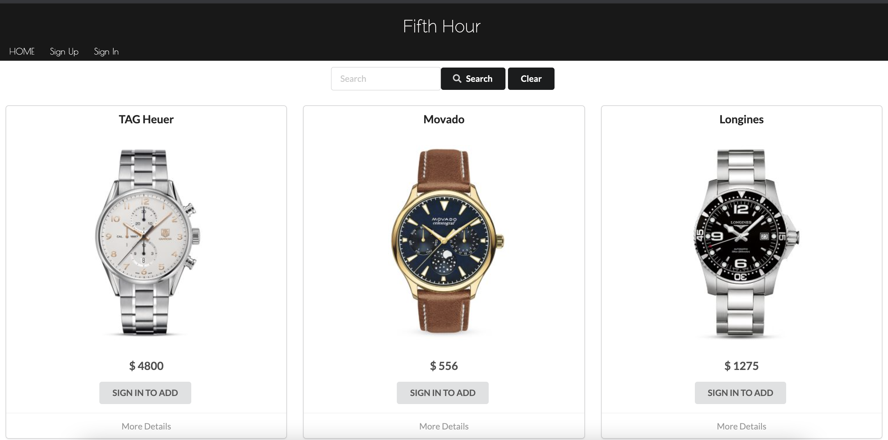
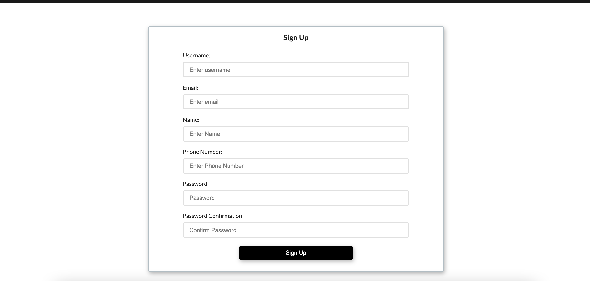

# Fifth Hour

## Descriptions
Fifth Hour is a full stack CRUD application built with Mern Stack and React as a front-end frameworks. This application contains the ability to allow customers to shop online for watches.

## Home Page

## Sign Up

## Sign In

## Contributors

  * Henry Baum
  * Sayed Naser  
  * Jasmine Snow

## Technologies

* Mern Stack
  * Mongo
  * Express
  * React
  * Node.js

* Create-react-app

## Features
* Include:
  * Login/ Register
  * View Products
  * Cart Functionality
  * Administrative privileges include adding inventory
    * Update, Delete

### Front-End Link

https://fifth-hour-frontend.herokuapp.com/

### Back-End Link

https://fifth-hour-backend.herokuapp.com/

https://github.com/goferboy/watches-frontend

#### Link to Wireframe

https://wireframe.cc/TLHP82
